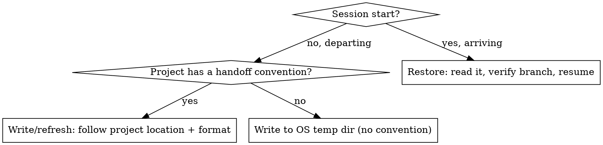

# Session Handoff

## Overview

A handoff document is the bridge between two sessions. It runs in **two directions**: you *restore* from it when arriving, and you *write* it when departing. The goal is that a fresh agent resumes the work in a single read, with the **next action stated explicitly** — not a narrative of what happened. If the doc reads like a diary, it failed.

## When to Use

- **Arriving**: a new session is meant to continue prior work; context was compacted away; you're asking "where were we"; you switched branches and need the prior state.
- **Departing**: ending or pausing with unfinished work; you see compaction markers in history and in-flight state would be lost; a fresh agent (or human) must pick up.

**When NOT to use**: the work is fully done and merged (clean up, don't hand off); a one-shot question with no ongoing state; a project forbids scratch files on its main branch (defer to that rule).

## Decide: Restore, Write, and Where

**Detecting a project convention** (check before writing anywhere): a repo-root handoff file (e.g. `session-handoff.md`), a template (e.g. `docs/templates/SESSION_HANDOFF_TEMPLATE.md`), or handoff rules in `CLAUDE.md` / `AGENTS.md`. If found, the **project owns the rules** — location, format, when-to-write, cleanup. Execute them; do not restate or override them here. If none found, write to the OS temp dir (`$TMPDIR`, else `/tmp`) so you never pollute the workspace.

## Restore (arriving session)

1. **Locate** the handoff: project-convention path → OS temp dir → most recent matching file.
2. **Verify the branch.** If the doc carries a `branch` field, compare against `git branch --show-current`. If they differ, **STOP and ask the user** — the handoff may be stale or you're on the wrong branch.
3. **Read it**, then treat the **Next best step** as your starting instruction.
4. **Invoke the Suggested skills** it lists before acting.
5. **Re-check only volatile claims.** "Tests pass" / "build green" were true when written — confirm them now. Don't re-derive what the doc already establishes.

## Write (departing session)

Start from [`assets/handoff-template.md`](assets/handoff-template.md) — copy it and fill every section: **Verified now** (+ the check that proved it) · **Changed this session** · **Broken or unverified** (+ risk) · **Next best step** (why · done-criteria · what must not change) · **Commands** · **Suggested skills**. When the project defines its own format, use that instead.

- **Reference artifacts, don't duplicate them** — link PRDs, plans, ADRs, commits, and diffs by path or URL instead of pasting.
- **Redact secrets and PII** before saving.
- **Overwrite** the existing handoff — one live doc, never two.

## Quick Reference

| Situation | Action |
|-----------|--------|
| Arriving, doc exists | Verify branch → read → resume from Next best step |
| Arriving, branch mismatch | STOP, ask the user |
| Departing, project convention exists | Write/refresh at its location, in its format |
| Departing, no convention | Write to OS temp dir |
| Work done + merged | No handoff — clean up instead |

## Common Mistakes

| Mistake | Fix |
|---------|-----|
| Doc narrates history | Lead with the next actionable step, not the story |
| Pastes commits/plans/PRDs | Reference by path or URL |
| Ignores a project's own handoff file, writes to temp dir | Detect and defer to the project convention first |
| Dumps scratch handoff into a clean workspace | No convention → OS temp dir |
| Acts on stale state | Verify branch + re-check volatile claims on restore |
| Leaks secrets/PII | Redact before saving |
